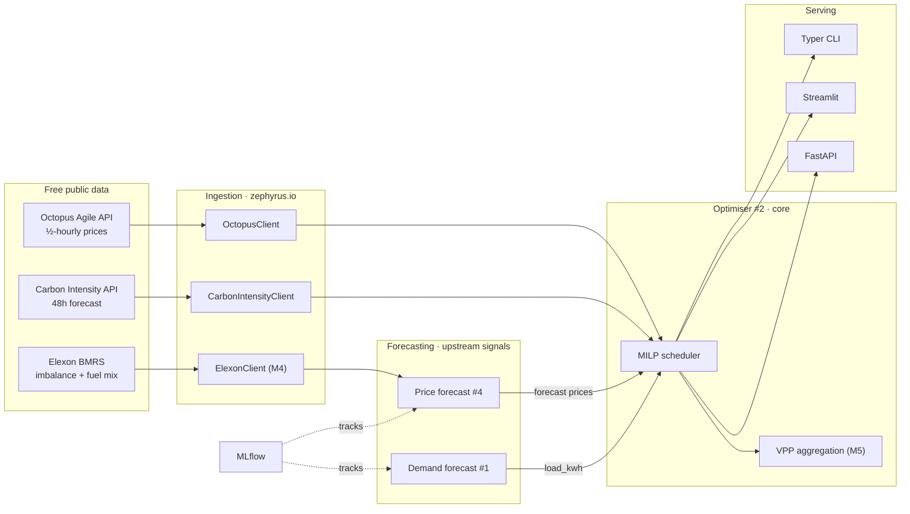

# ⚡ Zephyrus

**Forecast-driven flexibility optimisation for home batteries & EVs — turning distributed
energy assets into a virtual power plant.**

> *Named for Zephyrus, the Greek god of the west wind — a nod to renewable generation and the flexibility that balances it.*

[](https://github.com/AshutoshMore96/zephyrus/actions)


Zephyrus schedules a home battery/EV against **live UK half-hourly electricity prices**
(Octopus Agile) and the **National Grid carbon-intensity forecast** to minimise cost and
CO₂ — then aggregates many assets into a virtual power plant (VPP). It is a single,
production-shaped codebase that integrates three data-science projects:

1. **Demand forecasting** (`forecast/demand`) — predicts household load.
2. **Price forecasting** (`forecast/price`) — predicts wholesale/imbalance prices.
3. **Flexibility optimiser** (`optimise`) — a MILP that consumes both forecasts and the
   live carbon signal to decide when to charge and discharge. *This is the core.*

> **Why it exists.** Flexibility / VPP is the fastest-growing part of UK energy (Axle,
> Octopus Kraken Flex, OVO Kaluza). This project reproduces that value chain end-to-end —
> forecast → optimise → aggregate → settle — using only free, live public APIs.

## Architecture



See [`docs/architecture.md`](docs/architecture.md) for the data-flow detail and region map,
and [`docs/adr/0001-monorepo-and-forecast-driven-optimisation.md`](docs/adr/0001-monorepo-and-forecast-driven-optimisation.md)
for the key design decision.

## Quickstart

```bash
git clone https://github.com/AshutoshMore96/zephyrus && cd zephyrus
python -m venv .venv && source .venv/bin/activate
make install            # editable install + extras

make demo               # optimise a 5 kWh battery on TODAY'S live prices & carbon
make dashboard          # interactive demo (the recruiter-facing view)
make api                # REST API at http://localhost:8000/docs
make test               # offline test suite (APIs mocked with respx)
```

No API keys are required — the Octopus product/tariff and Carbon Intensity endpoints are
public.

## Repository layout

```
src/zephyrus/     config · logging · schemas · utils
  io/              Octopus + Carbon (live) · Elexon (stub)
  forecast/        demand (#1) · price (#4)  — baselines shipping, models on the roadmap
  optimise/        battery · milp (core) · vpp (stub)
  api/ dashboard/ cli.py
scripts/           fetch_sample_data.py · run_demo.py
tests/             pytest (offline)   docs/  configs/  .github/workflows/ci.yml
```

## Data sources (all free, all live)

| Source | Used for | Auth |
|--------|----------|------|
| [Octopus Energy API](https://developer.octopus.energy/rest/) | Agile half-hourly import prices | none |
| [National Grid Carbon Intensity API](https://carbon-intensity.github.io/api-definitions/) | 48h national/regional carbon forecast | none |
| [Elexon BMRS Insights](https://bmrs.elexon.co.uk/) | imbalance prices, generation by fuel type (#4) | none |
| [Open-Meteo](https://open-meteo.com/) | weather features (forecasting) | none |

## Results

Populate after your first run (`make demo` prints these):

| Scenario | Baseline cost | Optimised cost | £ saved | CO₂ saved |
|----------|--------------:|---------------:|--------:|----------:|
| 5 kWh battery, London, 24h | _tbd_ | _tbd_ | _tbd_ | _tbd_ |

Forecasting metrics (fill in as M3/M4 land): demand MAPE / pinball loss vs seasonal-naive;
price model hit-rate and arbitrage P&L vs persistence.

## Tech stack

Python 3.11 · Pydantic v2 · httpx + tenacity · **PuLP/CBC** (MILP) · pandas/numpy ·
FastAPI · Streamlit · Typer · MLflow · pytest + respx · ruff + black + mypy · Docker ·
GitHub Actions. Mirrors the modern UK-energy data stack (cloud, Spark/Databricks, dbt,
MLflow) at portfolio scale.

## Roadmap

Delivery is milestoned in [`ROADMAP.md`](ROADMAP.md) (M0 scaffold → M7 deploy). Contributions
follow [`CLAUDE.md`](CLAUDE.md).

## License

MIT © 2026 Ashutosh More
