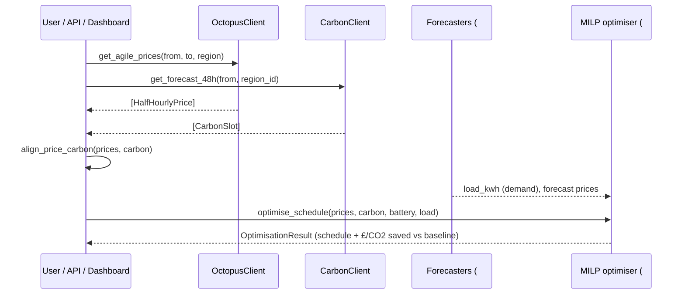

# Architecture

## Data flow

The optimiser is the hub. Forecasts are optional upstream signals: with the shipped
baselines the system runs end-to-end today; as the forecasting milestones land, their
outputs replace the baselines behind the same interfaces.

## The optimisation model (MILP)

For each half-hourly slot `t` (Δ = 0.5 h) the scheduler chooses charge/discharge power
for the battery, subject to:

- **State of charge** dynamics with one-way efficiency `η = √(round-trip)` on each leg;
  SoC bounded by `[soc_min, soc_max]`.
- **Energy balance:** `import + solar + discharge·Δ = load + charge·Δ + export`.
- **Mutual exclusion:** a binary per slot forbids simultaneous charge and discharge (the
  integer part of the MILP).

**Objective** (minimise): `Σ import·price − export·price + w · import · carbon/1000`,
where `w` (£/kg CO₂) trades cost against carbon (`w = 0` ⇒ pure cost minimisation).

Solved with CBC, bundled in the `pulp` wheel — no commercial solver required. The result
is compared against a naive baseline (meet net load from the grid, no arbitrage) to report
£ and kg-CO₂ saved.

## GSP regions (Octopus) & carbon regions

Octopus Agile prices vary by **GSP group letter**; the Carbon Intensity API uses **region
ids** (1–17). Common mappings:

| GSP letter | Area | Carbon region id |
|:----------:|------|:----------------:|
| A | East England | 10 |
| B | East Midlands | 9 |
| C | London | 13 |
| D | Merseyside & N. Wales | 7 |
| E | West Midlands | 8 |
| F | North East England | 5 |
| G | North West England | 6 |
| H | Southern England | 12 |
| J | South East England | 14 |
| K | South Wales | 15 |
| L | South West England | 11 |
| M | Yorkshire | 4 |
| N | South Scotland | 2 |
| P | North Scotland | 1 |

Set `ZEPHYRUS_GSP_GROUP` and `ZEPHYRUS_CARBON_REGION_ID` (or pass `gsp_group=` / `region_id=`).

## Testing

Unit tests run offline: the HTTP layer (`io/base.py`) is mocked with `respx`, and the
optimiser tests are pure and deterministic, doubling as the executable spec for correct
behaviour (non-negative savings, SoC bounds, no simultaneous charge/discharge).
